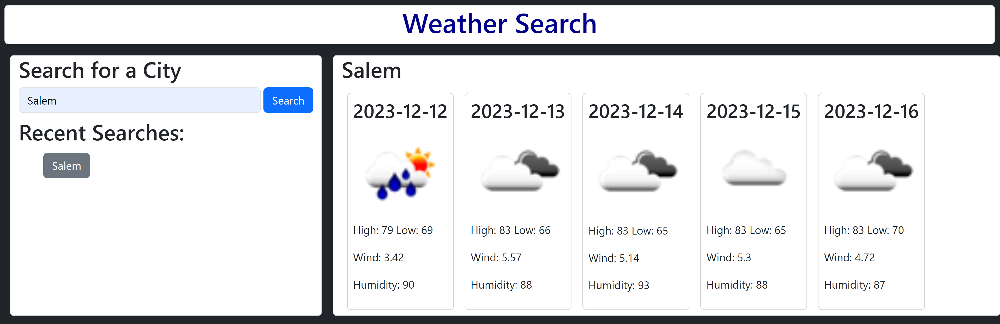

# Weather Search by City | Module 6 Challenge

## Challenge Overview

### Challenge Criteria
This challenge is apart of the coding bootcamp. Its purpose is to utilize a server side api and display weather data to the user. For this project I used https://api.openweathermap.org and their free api. The challenge had certain criteria I had to meet:

    -GIVEN a weather dashboard with form inputs
    -WHEN I search for a city
    -THEN I am presented with current and future conditions for that city and that city is added to the search history
    -WHEN I view current weather conditions for that city
    -THEN I am presented with the city name, the date, an icon representation of weather conditions, the temperature, the humidity, and the the wind speed
    -WHEN I view future weather conditions for that city
    -THEN I am presented with a 5-day forecast that displays the date, an icon     representation of weather conditions, the temperature, the wind speed, and the humidity
    -WHEN I click on a city in the search history
    -THEN I am again presented with current and future conditions for that city

## Installation
No installation required

## Usage
To view the project just use the link below to see the page on github pages!

    - https://chaselee21.github.io/weather-search/

## Contributing
For this project I worked with my classmate Will Schickler. Here is his repository for the same project

    - https://github.com/willber10/Weather-By-City-Search

## License

Please refer to the license in the repo
